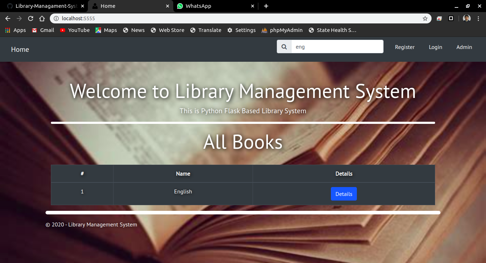

# Screenshot



---

---

# Start

- Clone the repository.

```sh
$ git clone https://github.com/kumaraditya303/Library-Managament-System.git
$ cd Library-Management-System
```

- Create Virtual Environment.

```sh
$ virtualenv venv
$ source venv/bin/activate
```

- Install dependencies.

```sh
$ pip install -r requirements.txt
```

- Run the application.

```bash
$ python wsgi.py
```

- Navigate to http://127.0.0.1:5000/

# Project made and maintained by [Kumar Aditya](https://www.github.com/kumaraditya303)
